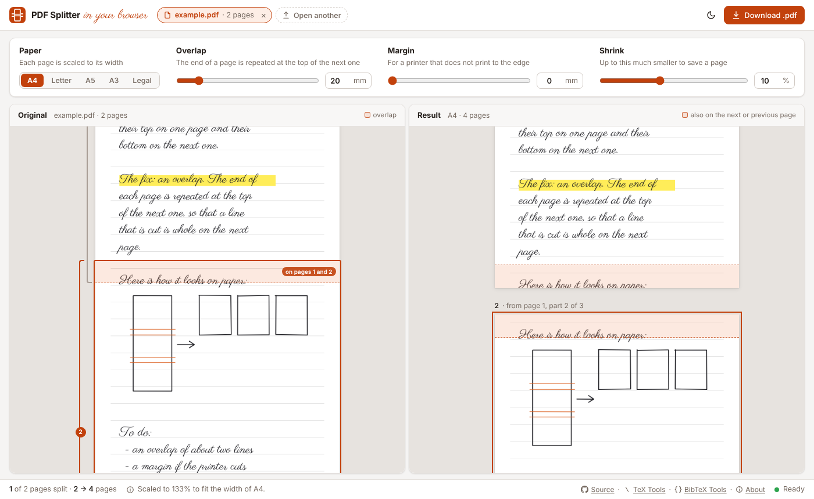

# PDF Splitter

Split tall pages onto pages of paper with an overlap, in your browser.

Notes from a reMarkable can have pages that are much longer than a page of
A4.  To print such a page, you can scale it down to fit, which makes the
writing tiny, or split it onto several pages, which cuts lines of handwriting
in half.  PDF Splitter splits each page with an overlap: the end of each page
is repeated at the top of the next one, so that a line that is cut at the
end of a page is whole on the next page.

## Web App
The web app shows where each page is cut, and the pages of paper, before you
download the PDF: open or drop your PDF on the page.  It runs Python in your
browser with [Pyodide](https://pyodide.org), so your files never leave your
computer.



* Each page is scaled to the width of the paper (A4, Letter, A5, A3, or
  Legal) and split onto as many pages as it needs.  A page that fits stays
  one page.
* The _overlap_ is the end of a page that is repeated at the top of the next
  one, 20 mm by default.  Make it higher than a line of your handwriting.
  It is marked on the original, and on the pages of paper.
* The _margin_ is for a printer that does not print to the edge of the
  paper.
* A page is made up to 10 % smaller (the _shrink_) if it then needs fewer
  pages, e.g., a page of a reMarkable, which is a bit too long for Letter, or
  a long page whose last bit would be almost alone on a page.
* Point at a page of paper to see where it comes from, and click it to
  scroll there.  Click a number on the left of the original to see its page.
* The strokes stay vectors, so they are as sharp as in the original, and each
  page is in the PDF only once, however many pages of paper show it.
* Annotations, e.g., comments or links, are not in the split PDF.  The web
  app tells you if a PDF has any.

To run the web app locally, build it and serve it on http://localhost:8000
with
```bash
python3 web/build.py --serve
```
The build downloads Pyodide and [pdf.js](https://mozilla.github.io/pdf.js/),
which shows the pages, from npm, and
[pypdf](https://github.com/py-pdf/pypdf), which writes the PDF, from PyPI,
once, and caches them in `~/.cache/pdfsplitter-web`.  The workflow
`.github/workflows/web.yml` publishes the web app with GitHub Pages for every
push to `main`.  In the settings of the repository, select _GitHub Actions_
as the source under _Pages_ once.

## Command Line and Python
```bash
pip install .
pdf-splitter notes.pdf                      # writes notes-a4.pdf
pdf-splitter notes.pdf --overlap 30 --margin 5 --paper letter -o print.pdf
```
Use `--shrink 0` to scale every page to the width of the paper.

In Python:
```python
from pdfsplitter import Options, split_pdf

with open("notes.pdf", "rb") as _file:
    result = split_pdf(_file.read(), Options(paper="a4", overlap=20))
with open("notes-a4.pdf", "wb") as _file:
    _file.write(result.data)
print(result.pages, [len(_layout.slices) for _layout in result.layouts])
```

## Tests
```bash
pip install -e ".[test]"
pytest
```
The example, `examples/example.pdf`, is made by `examples/make_example.py`
from the font in `web/fonts`.
